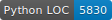

# Robotic Control System



Inspired by a Star Wars droid named Loadlifter

Python software to control the Hiwonder ArmPi Pro robot.

---

## Features

- Autonom driving in a warehouse using Mecanum wheels and a LiDAR
- Use robotic arm to pick up and place objects
- Camera for object detection with machine learning
- Demo videos available on my YouTube https://www.youtube.com/@danielrmv

---

👨🏽‍💻 Created as a student project

---

## Installation auf dem Raspberry Pi

1. **System vorbereiten**
   - Raspberry Pi OS oder Ubuntu empfohlen und alle Updates einspielen:\
     `sudo apt update && sudo apt full-upgrade -y`
   - Basis-Werkzeuge installieren:\
     `sudo apt install -y git python3 python3-pip python3-venv libgpiod2`
   - Optional: Zusätzliche Tools für Kamera, I2C und serielle Schnittstellen aktivieren (`sudo raspi-config`) und bei Bedarf `libatlas-base-dev` für schnellere NumPy-Operationen installieren.

2. **Repository klonen**
   ```bash
   cd ~
   git clone https://github.com/daniel-rmv/Loadlifter.git
   cd Loadlifter
   ```

3. **Python-Umgebung anlegen**
   ```bash
   python3 -m venv .venv
   source .venv/bin/activate
   python -m pip install --upgrade pip
   ```

4. **Python-Abhängigkeiten installieren**
   ```bash
   pip install -r requirements.txt
   ```
   - Für Kamerafunktionen sicherstellen, dass die Raspberry-Pi-Kamera aktiviert ist.
   - Für den `gpiod`-Pfad ggf. `sudo adduser $USER gpio` ausführen und neu anmelden.

5. **Hardware vorbereiten**
   - I2C für Motorcontroller aktivieren (`sudo raspi-config` → Interface Options → I2C).
   - Serielle Schnittstelle für Servos/LiDAR konfektionieren (UART aktivieren, Konsolen-Login deaktivieren).
   - Verkabelung für Buzzer, Lidar, Motorcontroller und Kamera prüfen.

6. **Software testen**
   - Beispiel: Steuerung über CLI starten\
     ```bash
     python -m src --help
     ```
   - Für Live-Visualisierung PC/Laptop nehmen und Kamera/LiDAR starten.
   
---

## Overlay-Client auf dem Mac starten

1. **Repository klonen**
   ```bash
   cd ~
   git clone https://github.com/daniel-rmv/Loadlifter.git
   cd Loadlifter
   ```

2. **Virtuelle Umgebung und Abhängigkeiten**
   - Python 3 ist auf macOS bereits vorhanden (bei Bedarf über Homebrew aktualisieren).
   - Virtuelle Umgebung anlegen und Pakete installieren:
     ```bash
     python3 -m venv .venv
     source .venv/bin/activate
     python -m pip install --upgrade pip
     pip install -r requirements.txt
     ```

3. **Overlay-Client ausführen**
   - Sicherstellen, dass auf dem Pi der MJPEG-Stream läuft (`python -m src.low_level.camera_bridge`).
   - Overlay-Client starten und die Pi-IP einsetzen:
     ```bash
     python -m src.visualization.overlay_client --pi <pi-ip>:5000
     ```
   - Optional das Modell oder Parameter wie `--conf` (Konfidenz) oder `--fps` anpassen. Standardmodell liegt unter `models/best.pt`.
